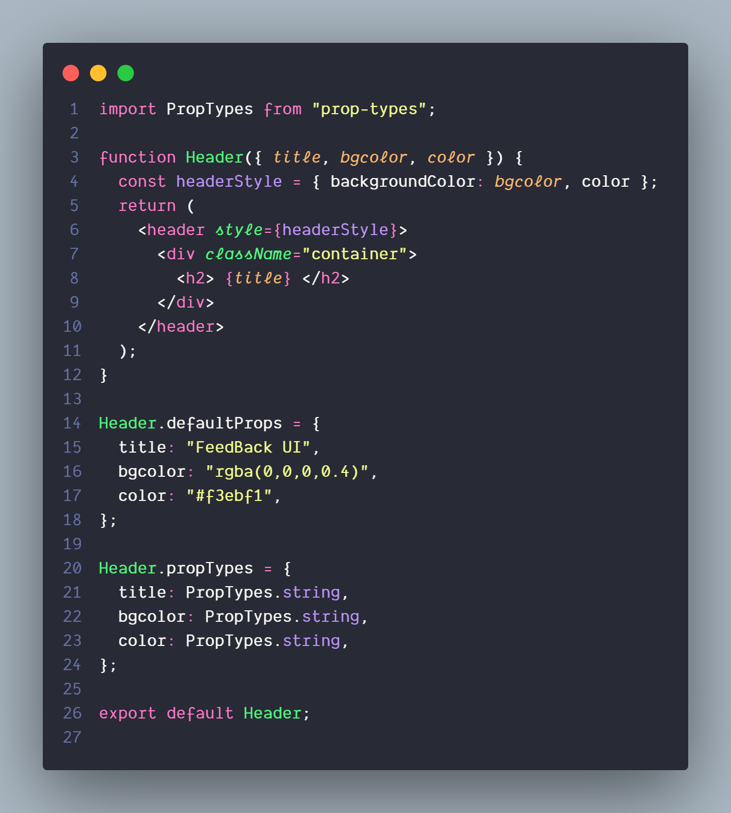

# Getting Started with Create React App

This project was bootstrapped with [Create React App](https://github.com/facebook/create-react-app).

## Available Scripts

In the project directory, you can run:

###### Install dependencies 
### `npm install`

###### Start the  Server
### `npm start`

###### Perform Testing
### `npm test`

###### Build for Production
### `npm run build`

****

## Code Simples 

### Context provider

### Header Component

